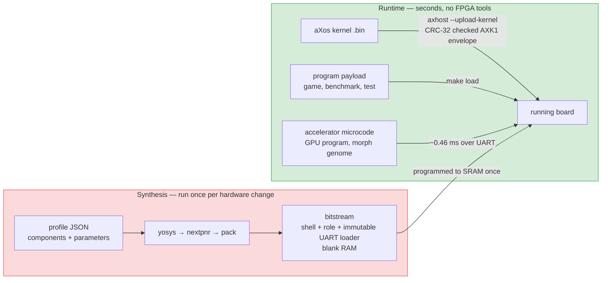

<div align="center">


**A composable platform for hardware/software co-design.**

Build the reference machine — or replace the parts that matter to you.

[](https://github.com/xylene-labs/atomiX/actions/workflows/ci.yml)
[](https://github.com/xylene-labs/atomiX/actions/workflows/nightly.yml)
[](https://github.com/xylene-labs/atomiX/actions/workflows/formal.yml)

[Architecture](DESIGN.md) ·
[Build, test, deploy](docs/workflow.md) ·
[Dependencies](docs/dependencies.md) ·
[Components](components/README.md) ·
[Roadmap & priorities](docs/roadmap.md) ·
[Live checklist](docs/design-checklist.md) ·
[Research checklist](docs/research-checklist.md)

</div>

---

## What is atomiX?

atomiX is a hardware/software co-design project built around a from-scratch
RISC-V reference computer. The reference build includes a five-stage CPU, SoC,
bare-metal runtime, and the aXos kernel. On the FPGA target, that computer serves
as the management shell while accelerator roles attach at a defined boundary —
the role window is live today (`role.loopback` proves it), with TPU-lite,
GPU-compute, and the banked-memory gpu1 family implemented and verified as
selectable roles.  Their completion is available either polled or as a machine
external interrupt through the shell's PLIC.

```text
  RISC-V core ── aXbus SoC ── aXos
       │             │          │
       └──── selectable components ────┐
                                        ▼
                    FPGA shell + swappable accelerator roles
```

| Reference machine | Evidence | Platform direction |
|---|---|---|
| RV32IM, five stages, M/S/U + Sv32 | ISS · lock-step RTL · ISA tests · 4-instruction formal | ULX3S/Tang shells + swappable accelerator roles |

It is designed to be modified.  A user can substitute the CPU, memory,
interconnect, peripherals, board, simulation harness, or aXos service policy
without forking the rest of the project.

The next step is an **open architecture experimentation platform**: bring a
workload, explore software and hardware implementations, and share a reproducible
design decision. The [execution-target plan](docs/execution-targets.md) spans
native CPU execution, simulation/emulation, GPU or other accelerator backends,
FPGA, and staged ASIC research. RISC-V is the reference ISA; the workload
contract can describe implementations using other ISAs and runtimes.

That platform now runs its first loop. An experiment plan names a workload, its
oracle, the implementations that claim to satisfy it, and the targets that can
host them; `make experiment-run` executes it through native-host and RTL
adapters, and `make experiment-report` compares what came back without ever
ranking across measurement domains. Two fixtures ship: one `cpu_perf` image on
three cores (70,650 / 42,978 / 25,729 cycles at one payload hash and three
machine hashes), and one SAXPY workload implemented twice — a host C executable
and a SIMT kernel swept over 1, 2, 4, and 8 lanes (505 / 332 / 240 / 212 model
cycles). A controlled co-design plan additionally compares GCC `-O0`/`-O2` and
a complete two-algorithm by two-lane RTL matrix, retaining a negative result
when replacing multiply-by-three with additions loses at both widths. Those
three CPU candidates are also the deterministic preview
regression subset checked by `make experiment-regression-check`; host elapsed
time remains diagnostic. [Start here](docs/experiment-alpha.md) to run either.

The [roadmap](docs/roadmap.md) and [priority boards](docs/boards/README.md)
continue with independent alpha reproduction and reproducible preview-release
preparation. Those are planned outcomes; the evidence below describes what
runs today.

## Where this sits

atomiX is not competing with the projects below, and for most purposes one of
them is the right answer:

| If you want | Use |
|---|---|
| A production-grade, heavily verified embedded core | [Ibex](https://github.com/lowRISC/ibex) |
| A Linux-capable application core | [CVA6](https://github.com/openhwgroup/cva6), [Rocket Chip](https://github.com/chipsalliance/rocket-chip) |
| One core that configures to fit almost anything | [VexRiscv](https://github.com/SpinalHDL/VexRiscv) |
| The smallest thing that runs RV32 | [PicoRV32](https://github.com/YosysHQ/picorv32), [SERV](https://github.com/olofk/serv) |
| A complete, well-documented RV32 SoC in one repository | [NEORV32](https://github.com/stnolting/neorv32) |
| To assemble an SoC from existing cores across many boards | [LiteX](https://github.com/enjoy-digital/litex) |

Those are more capable machines and better-supported projects, maintained by
more people for longer.  If one of them fits, use it.

atomiX exists to answer a different question: **what does a system look like if
every seam in it is replaceable, and a replacement has to earn its own
verification claim rather than inherit one?**  Three things follow from that,
and they are what is actually on offer here:

- **The seam is the product, and it runs the whole height of the machine.**
  The core, ALU, multiplier, bus, peripherals, memory, board, simulation
  harness, and the kernel's own scheduler, allocator, filesystem and syscall
  table are all selectable components with manifests; a profile picks them and
  the build refuses an incoherent selection.  Swapping a multiplier and swapping
  the entire CPU are the same kind of operation.
- **Evidence is typed, and the types never merge.**  Simulation, synthesis,
  place-and-route, and execution on a physical board are separate claims; a
  board result names hardware rather than a program, and this repository will
  not describe a bitstream that was never loaded as a hardware result.  Selecting
  a component grants it nothing: `muldiv.fast-mul`, `core.ax2` and `core.minimal`
  each carry their own testbench, cosim, ISA-suite or formal evidence, recorded
  with the command that reproduces it.
- **Reconfiguration is a runtime event, not a build.**  An immutable shell plus
  a role window means a new program, kernel, or accelerator microcode is an
  upload over UART in milliseconds — re-synthesis is reserved for actual
  hardware changes.

Set against that, the limits, stated plainly rather than left to be discovered:

- RV32IM only.  No A, C, or floating point; one hart; no Linux — aXos is its own
  small kernel, not a port.
- One board has ever run it: a Tang Primer 25K, first on 2026-07-29.  Everything
  claimed for the ULX3S and Tang Nano is synthesis and place-and-route.
- The formal evidence is four instructions (see below), not a verified core.
- Seven weeks old, one author, no release yet.  Nothing here has been
  independently reproduced.

If any of that is disqualifying for what you are doing, one of the projects
above will serve you better — which is why they are listed first.

## How a change reaches the board

The normal reconfiguration path is program loading, not synthesis:
`make runtime-primer` uploads one 32 KiB aXos payload into a stable RTL image,
then loads, runs, replaces, and re-runs GPU microcode in milliseconds.
Kernel builds follow the same rule: the fixed image boots an immutable UART
loader and `axhost --upload-kernel` installs aXos into blank RAM with CRC-32
verification, so kernel changes never invoke FPGA tools.



**Software is never part of a bitstream's identity.** A new example, game, or
kernel change must not require re-synthesis and must not re-open an existing
board claim — which is why a board result names hardware rather than a program.
The baked-payload path exists for first bring-up only.

## Verified on hardware

On 2026-07-29, a Sipeed Tang Primer 25K Dock completed the first physical
atomiX bring-up. The RV32IM CPU booted from on-chip BSRAM and printed over the
Dock UART; separate volatile-SRAM images then passed the self-checking 4-lane
GPU-compute and folded 24-MAC TPU-lite workloads. See the
[captured evidence](docs/achievements/tangprimer25k.md#cpu-gpu-and-tpu-images--2026-07-29)
and [reproduction procedure](docs/tangprimer25k-bringup.md).

**Status:** simulation-verified reference system · component-first builds ·
Tang Primer 25K CPU, GPU, and TPU verified on physical FPGA hardware.

## Continuous verification

Three pipelines run against every claim in this README.  Each job uploads its
evidence as a workflow artifact, so a green badge is a result you can open and
read rather than a colour you have to trust.

| Pipeline | Runs on | Jobs | Evidence artifact |
|---|---|---|---|
| [](https://github.com/xylene-labs/atomiX/actions/workflows/ci.yml) | every push and pull request | golden ISS, profile manifests, and lock-step cosim · RTL unit testbenches · composed systems and aXos | `verification-ci-*` |
| [](https://github.com/xylene-labs/atomiX/actions/workflows/nightly.yml) | 03:17 UTC daily | full integrated software and RTL ladder · randomized generation and fuzzing · official RISC-V ISA suite · ISS/QEMU/RTL agreement | `verification-nightly-*` |
| [](https://github.com/xylene-labs/atomiX/actions/workflows/formal.yml) | 04:23 UTC Sundays | bounded riscv-formal proofs of `insn_add`, `insn_beq`, `insn_lw` and `insn_sw` — on the reference core, `core.minimal`, and both retire channels of `core.ax2` | `formal-counterexamples` |

**Read the Formal badge narrowly.**  It is four instructions under bounded model
checking, in an RV32I configuration — 15 checks across three cores, and for
`core.ax2` that is 7 of the 84 checks riscv-formal generates, with the M
extension and the branch predictor switched off.  It is a real proof of a small
thing, not a verified core.  Everything the M extension, the CSR surface, and
the MMU do is covered by the ISA suite, lock-step cosimulation and directed
tests instead, which is a different and weaker kind of evidence.  The full scope
statement is in the [design checklist](docs/design-checklist.md).

Hardware results are not in that set, and deliberately so: a board claim needs
a board.  Those are captured by hand, with commands and transcripts, in
[docs/tangprimer25k-bringup.md](docs/tangprimer25k-bringup.md) and
[docs/ulx3s-bringup.md](docs/ulx3s-bringup.md).

## Start in three commands

Install the core tools first — the safe, tiered instructions are in
[Dependencies](docs/dependencies.md).

```bash
make -C sim/axsim test
make -C sw/baremetal images
make sim CONFIG=configs/sim-bram.json \
  RAM_INIT_FILE="$PWD/sw/baremetal/build/hello.hex"
```

That path builds the golden ISS, creates a target image, and runs it on the
selected Verilated SoC.  Continue with the
[build/test/deploy reference](docs/workflow.md) for three-platform checks,
randomized cosimulation, aXos, host-link, formal verification, and FPGA
synthesis — it is the single, maintained list of every command.

## Or boot it with nothing installed

The same Verilated SoC compiles to WebAssembly, so aXos boots in a browser tab
with no toolchain and no FPGA — 27,509 cycles to a shell prompt in about 30 ms,
which is native wall-clock parity on the same host.

```bash
./tools/web.sh                # or: make web
```

One command from a plain shell: it sources the Emscripten SDK, picks a
Verilator the suite is green on, builds the payload if it is missing, verifies
the machine headlessly, finds a free port, and opens the page. Emscripten is
the one thing it cannot install for you — see [docs/toolchain.md](docs/toolchain.md).

It is the machine, not a re-implementation: the page clocks the model through
the same runner code `make sim` uses, so a cycle count read off it is the one a
local run reports.

```bash
make web-compare              # the same binary on three cores, side by side
```

That is the argument for a component system rather than a description of one:
three machines differing in exactly one component — the core — run one
`cpu_perf` binary in lock-step simulated cycles and report **70,650**,
**42,978**, and **25,729** cycles, all agreeing on the same checksum. Details in
[sim/web/](sim/web/).

## Build it your way

Profiles select compatible components; manifests make every selection visible
and reproducible.

```bash
make component-list
make config-check CONFIG=configs/sim-bram.json
make component-show COMPONENT=memory.sdram
```

The stock integration contracts are intentionally small.  An external manifest
can point to an out-of-tree implementation, but it earns its own compatibility
and verification claim.  Read the [component catalog](components/README.md),
[profile guide](configs/README.md), and
[component map](docs/component-map.md) before making a replacement.

## Where to go next

| I want to… | Start here |
|---|---|
| Understand the machine | [DESIGN.md](DESIGN.md) |
| Play a game on a board I own | [docs/games.md](docs/games.md) |
| Build, test, or synthesize | [docs/workflow.md](docs/workflow.md) |
| Set up a host or FPGA toolchain | [docs/dependencies.md](docs/dependencies.md) |
| Change an implementation | [components/README.md](components/README.md) |
| Understand the direction and pick the next task | [Roadmap](docs/roadmap.md) · [Priority boards](docs/boards/README.md) |
| Explore execution targets beyond FPGA | [Execution-target design](docs/execution-targets.md) · [Targets board](docs/boards/targets.md) |
| Inspect current evidence and open work | [docs/design-checklist.md](docs/design-checklist.md) |
| Track partial reconfiguration, morph compute, and adaptive-logic research | [docs/research-checklist.md](docs/research-checklist.md) |
| Extend the open compute-personality contract | [docs/personality-contract.md](docs/personality-contract.md) |
| Compare compute implementations without a vendor-specific score | [docs/comparison-contract.md](docs/comparison-contract.md) |
| Follow the adaptive “Live FPGA” track | [docs/live-fpga.md](docs/live-fpga.md) |
| Prepare the Tang Primer 25K | [docs/tangprimer25k-bringup.md](docs/tangprimer25k-bringup.md) |
| Prepare the ULX3S | [docs/ulx3s-bringup.md](docs/ulx3s-bringup.md) |
| Use the logo or the mark | [docs/assets/README.md](docs/assets/README.md) |

## Repository map

| Area | Purpose |
|---|---|
| [components/](components/) | Selectable manifests and their owned RTL/service sources |
| [configs/](configs/) | Reproducible system and kernel-service profiles |
| [research/](research/) | Versioned research contracts, workloads, and experiment inputs |
| [sim/](sim/) | ISS, lock-step harnesses, SoC runner, and generators |
| [formal/](formal/) | riscv-formal and SymbiYosys integration |
| [rtl/](rtl/) | Generic FPGA flow and architecture entry points |
| [sw/](sw/) | Bare-metal runtime, boot ROM, aXos, and future host/user software |
| [docs/](docs/) | Build, dependency, architecture, and board documentation |

## Licence, attribution, and marks

atomiX is copyright © 2026 Shubhendra Gautam and atomiX contributors, released
under the [MIT License](LICENSE).

| File | Purpose |
|---|---|
| [LICENSE](LICENSE) | MIT terms — the copyright grant |
| [NOTICE](NOTICE) | attribution notice and external tool dependencies |
| [AUTHORS.md](AUTHORS.md) | who wrote it |
| [CITATION.cff](CITATION.cff) | how to cite it in published work |
| [TRADEMARKS.md](TRADEMARKS.md) | use of the atomiX name, and third-party marks |
| [CONTRIBUTING.md](CONTRIBUTING.md) | DCO sign-off and evidence standards |

The MIT License grants broad rights to use, modify and redistribute the code,
including commercially. It does **not** grant rights in the project's name:
that is covered separately by [TRADEMARKS.md](TRADEMARKS.md).

---

<div align="center">

**Build what teaches. Verify what matters. Keep the seams open.**

</div>
