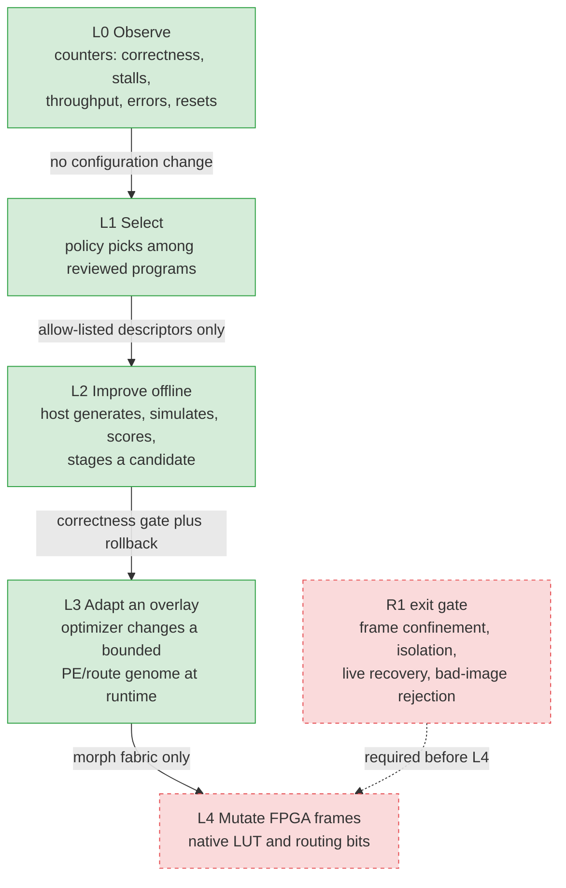
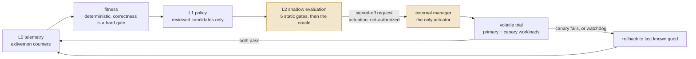

# Research checklist

This checklist tracks atomiX research questions separately from the engineering
completion gates in [design-checklist.md](design-checklist.md).  A plausible
idea is not a capability: every checked research item needs a recorded
experiment, artifact, result, and decision.  A useful negative result counts.

Status legend:

- `[x]` Evidence recorded and the stated question answered.
- `[~]` Partial evidence exists; the question remains open.
- `[ ]` Queued experiment.
- `[!]` Blocked on hardware, tooling, or a prerequisite named in the item.

The only purchased and physically verified board is the Tang Primer 25K Dock
(GW5A-25A).  Work labelled **no hardware** can proceed now.  ULX3S work may
produce build and analysis evidence, but cannot close a live-hardware gate
until that board is acquired or borrowed.

The [platform roadmap](roadmap.md) explains which research results could make
atomiX useful to other teams. The [research priority board](boards/research.md)
owns the active order, dependencies, and first slices. The questions below add
new product-directed experiments; they do not change the evidence status of R1,
R2, or R3.

## Research rules

Each experiment must record:

1. the hypothesis and one falsifiable success criterion;
2. exact sources, profile, tool versions, seed, and command;
3. correctness results before performance results;
4. latency, throughput, and FPGA resource/timing results where applicable;
5. raw artifacts plus a short conclusion and next decision.

Never use `verified`, `adaptive`, `partial`, or `live` for a result that only
demonstrates synthesis.  Simulation, place-and-route, volatile board execution,
and live reconfiguration are separate evidence levels.

A recorded number must reproduce from the command recorded beside it.  On
2026-08-10 the RTL fast-switch evidence record was found to claim load/execute
cycles of 340/889 and 119/701 that its own command had never produced, at any
commit; the real figures are 119/887 and 119/699.  Records are now resealed
with `python3 tools/candidate_registry.py seal`, which recomputes content IDs
and registry references and refuses to refresh a tracked artifact digest
unless the caller states that the test was re-run.

## Platform research questions

- [ ] **RX-01 — Search quality against exhaustive enumeration.** Hypothesis:
  a replaceable search policy can recover useful configurations with fewer
  evaluations than enumerating the same valid space. Use AX-02/AX-03 to record
  a complete small-space reference frontier, then freeze the workload split,
  seeds, budget, quality metric, and acceptable loss before running the policy.
  Count failed evaluations and search overhead; evaluate on held-out cases and
  retain multiple seeds. Close with a reproducible comparison and a decision
  to adopt the policy, revise it, or retain enumeration. Fewer trials without
  comparable solution quality do not establish a benefit. No search result
  grants activation authority.

- [ ] **RX-02 — End-to-end accelerator crossover.** Hypothesis: a resident
  accelerator improves complete-job latency for an identifiable workload/input
  range after transfer, dispatch, execution, readback, and verification costs.
  Freeze matched CPU/role workloads and an input-size range spanning likely
  overhead-dominated and compute-dominated cases. Measure cold and reused
  sessions separately with the existing comparison contract; record correctness
  first, then all observable cost components. Close with a measured crossover
  or a bounded finding of no crossover, uncertainty/repeats where relevant,
  and a decision on which workload or bottleneck deserves engineering. Keep
  host transport observations separate from simulated cycles and P&R estimates.
  This result decides whether AX-09 asynchronous jobs earn higher priority.

- [ ] **RX-03 — Adaptation against the best fixed configuration.** Hypothesis:
  selecting reviewed resident personalities over a changing workload beats the
  best fixed supported choice after transition, canary, and recovery costs.
  Freeze a workload sequence with held-out phases, fixed-choice baselines,
  policy inputs, evaluation budget, and success threshold before the trial.
  Compare against the best fixed baseline over the whole sequence; report an
  ideal foreknowledge baseline separately if used. Inject a bad candidate and
  timeout, require oracle rejection and known-good recovery, and count those
  costs. Close with a reproducible gain or refutation and the domain where the
  conclusion applies. Use existing reviewed authority; any actuation change
  first needs the R3 telemetry/watchdog decisions. Simulation cannot close the
  physical-trial gate or authorize L4 frame mutation.

- [ ] **RX-08 — ASIC portability dependency audit.** Question: which parts of
  a selected small RTL block depend on FPGA memory, arithmetic primitives,
  initialization, clock/reset, or I/O assumptions, and which component seams
  need technology-specific alternatives? Inventory exact source/manifests and
  classify each dependency as portable logic, an existing adapter, or required
  work. Specify memory semantics, startup/reset behavior, clock assumptions,
  and a verification route for each proposed replacement. Close with a reviewed
  dependency map, selected block, bounded next experiment, and an explicit
  proceed/defer decision. No PDK or physical device is needed for the audit;
  completing it does not prove an ASIC implementation.
  Current execution: `axpe` is the selected block. PE-01 pins the official
  CMOS5L template and its `tt_um_*` I/O/reset contract. PE-02 has now bound the
  wrapper and found that the exact pinned CMOS5L PDK has no compatible SRAM
  macro views: the 64×32 inferred fallback preserves the single-port,
  synchronous-read contract and passes the shared chip suite, but the complete
  dependency map and physical result remain open.

- [ ] **RX-09 — Technology-specific implementation feasibility.** Hypothesis:
  the RX-08 block can meet declared area/timing constraints under an accessible
  technology/library flow while preserving its functional contract. Before
  execution, pin block/source, libraries and usage permissions, tools, memory
  models, clocks/I/O constraints, timing corners, resource budget, and success
  criteria. Prove functional/equivalence checks appropriate to the replacement,
  then record synthesis and physical-design results at their actual stages,
  including timing violations, missing macros, and unresolved verification.
  Close with a reproducible feasibility result or refutation and next decision.
  Area/timing estimates are technology-specific; power requires a documented
  activity/method assumption and stays an estimate. Missing libraries or tools
  block execution. This gate establishes neither sign-off nor manufactured
  silicon; fabrication needs its own verification, test, packaging, resource,
  and bring-up plan.
  Current execution: the protocol-emulator board records the official 6×4
  source baseline and exact support-tools rectangle. The action, support tools,
  PDK commit, LibreLane version, 20 ns clock, 64-word candidate and pass/fail
  criteria are pinned in `asic/axpe/flow-lock.json`; `make tt-export` produces
  the hashed input repository. Wrapper-level functional verification passes,
  but no physical flow has completed yet, so RX-09 remains open.

## R1 — Partial reconfiguration of an FPGA

**Question:** can atomiX replace only the accelerator role while the management
CPU, memory, UART, and loader remain alive and unchanged?

Production dynamic-function-exchange flows preserve one static placement and
routing result across configurations, while the changing module occupies an
explicit partition.  The atomiX experiment follows the same invariants even
though its current open-source ECP5 path is lower-level.  See the
[AMD DFX introduction](https://docs.amd.com/r/2024.2-English/ug909-vivado-partial-reconfiguration/Introduction)
and the detailed atomiX [partial-reconfiguration plan](partial-reconfig.md).

- [x] Define a stable, isolatable role ABI and keep the management shell
  outside it.  Evidence: `axrole` plus `axroleiso` and their tests — and, since
  2026-08-10, **the fence running on real silicon**.  On the Tang Primer the
  full swap protocol minus the bitstream write was executed: with the fence
  asserted every read of the role window completed and returned zero, the role
  stayed invisible while held in reset, the management CPU and the Live FPGA
  monitor kept running throughout, and releasing the fence restored the role
  and allowed a verified personality change.  `make -C sw/baremetal
  check-roleiso` is the simulation gate; the board result and hashes are in
  [tangprimer25k.md](achievements/tangprimer25k.md).  This is the R1 exit
  gate's isolation clause, discharged on hardware even though the Primer
  cannot supply the configuration write.
- [x] Build same-seed ECP5-85F `role.none` and `role.loopback` baselines and
  measure their delta.  The unconstrained result changes 8,603/13,294 CRAM
  frames across all 126 frame groups, proving that ordinary P&R is not a
  usable partial image.  Evidence: `make -C rtl/fpga pr-delta`.
- [x] Decode the changed-frame set and emit a real partial bitstream.  The
  85F's missing frame-address encoder was treated as the thing to defeat; it
  was cheaper to remove the need for it.  `ecppack --delta` fully supports the
  ECP5-45F, the ULX3S ships a 45F variant on the same CABGA381 package and
  pinout, and the atomiX shell needs 13,782 LUT4 against the 45F's 44,000 — so
  nothing in R1's question required the 85F.  Retargeting is a board-manifest
  change (`board.ulx3s-45f`, `--45k`, idcode `0x41112043`) reusing the 85F
  sources and constraint file unchanged.  No ULX3S is in hand for either
  variant, so the hardware gate is exactly where it was.

  **A partial bitstream for the atomiX role swap now exists.**  Evidence:
  `make -C rtl/fpga pr-delta PR_REFERENCE_CONFIG=../../configs/ulx3s-45f.json
  PR_CANDIDATE_CONFIG=../../configs/ulx3s-45f-loopback.json`.  It writes 7,377
  frames, each with an explicit `LSC_WRITE_ADDRESS`, verified independently by
  `tools/ecp5_frames.py`.

- [~] **No hardware:** validate or implement the ECP5-85F frame-address map
  against full bitstreams and deliberately small placement changes.
  **Deprioritised, not abandoned:** the 45F retarget above removes this from
  R1's critical path.  The investigation and its apparatus are kept because the
  map is still the only route to partial reconfiguration on an 85F board, and
  because the probe method generalises.  What it established:
  Trellis's refusal is a hardcoded `FIXME`, not missing data — `devices.json`
  already carries the full 85F geometry; the map cannot be read from a full
  bitstream, which names no addresses; single-tile `.config` perturbations
  yield exact index/address pairs (26 recorded from 55 sites in
  `research/partial-reconfig/ecp5-45f-frame-address-probe.json`); and the
  offset is piecewise over at least nine segments and non-monotonic.  A second
  obstacle was also found: `ecppack` compresses 85F frame data even without
  `--compress`.  **The decompression sub-blocker is now closed:** one shared
  prefix-free decoder serves `pr_delta.py` and `ecp5_frames.py`, a fresh seed-1
  85F build at 27.40 MHz decodes to the database's exact 13,294x142-byte
  geometry, the 45F cross-check retains its 7,377 full/delta frame count, and
  malformed streams are rejected.  Evidence:
  `research/partial-reconfig/ecp5-85f-frame-decode.json` and
  `make ecp5-frame-check`.  Read that command's output rather than its exit
  code: the geometry comparison is against prjtrellis's `devices.json`, which
  ships with the FPGA toolchain and not with this repository, so a machine
  without one runs the deterministic decoder tests and prints
  `ECP5 frame evidence: SKIPPED` for the comparison that is the point.  Point
  `TRELLIS_DB` at a `share/trellis/database` directory to make it run.  CI has
  no toolchain, so a green nightly is not evidence for this line.  Full images
  still carry no explicit addresses, so deriving and validating the 85F address
  function remains open.

- [ ] **85F map closure — deferred behind 45F confinement.** State the
  address-function hypothesis, then test independent tile perturbations at
  segment boundaries and held-out locations. Compare the 45F control against
  its existing encoder and require explicit rejection of unsupported 85F
  cases. Close only when the derived addresses agree with independent probes
  and packed-delta round trips; a decoded full-image geometry is insufficient.
  Record a missing Trellis database as skipped evidence, not a successful map.

- [~] **No hardware — now the binding constraint:** lock shell placement and
  routing, constrain the role to whole-frame-compatible columns, and show that
  two role implementations have identical shell frames and boundary routing.
  With `--delta` working on the 45F, this is measurable rather than
  theoretical: unconstrained place-and-route rewrites 7,377 of 9,470 frames
  (77.9%), spread over 89 columns and 69 rows, touching all 90 frame groups.
  The resulting "partial" image is 892,674 bytes against 381,080 for the full
  compressed bitstream — **2.3x larger than simply reloading the whole
  device**, which is the sharpest possible statement of why confinement, not
  the encoder, was always the real problem.

  The first locking experiment is recorded in
  `research/partial-reconfig/ecp5-45f-shell-lock-probe.json`.  Preserving
  hierarchy through Yosys makes 24,567 of 24,743 candidate shell placements
  reusable (99.29%).  The rectangular-region hint places 1,491 of 1,494
  packed loopback cells in X1--X13, but three clustered LUTs escape as far as
  X18; `tools/pr_floorplan.py` now rejects that at pre-route.  That is real
  progress, but not the invariant: nextpnr's packer still creates 176
  candidate-only shell cells and removes 156 reference shell cells.  Those
  unmatched carry cells make a placement-only resume fail on a hardwired
  carry conflict, while importing the 28,350 routes whose endpoint sets do
  match hits a router1 assertion.  Worse, `synth_ecp5 -noflatten` grows the
  empty-role shell from 15,071 to 20,491 `TRELLIS_COMB` cells and the routed
  reference reaches only 21.91 MHz versus 28.62 MHz flattened.  The next iteration must
  use a separately synthesised physical role boundary (or fix nextpnr's
  packed-netlist resume), not make global `-noflatten` the production flow.
- [ ] **45F confinement gate 1 — stable shell construction.** Compare a
  separately synthesised role boundary with a scoped packed-netlist resume
  fix, keeping device, shell sources, boundary contract, and build inputs
  matched. Account for unmatched packed cells and boundary nets, and record
  resource/timing costs and tool failures. Close with identical shell cells,
  placement, and routing across `role.none` and `role.loopback`, or a recorded
  refutation of the attempted method; a refutation does not close confinement.
- [ ] **45F confinement gate 2 — an accepted candidate delta.** After stable
  shell construction, generate a candidate whose changed frames all lie in
  the measured role region, with unchanged shell frames and boundary routing.
  Require the existing independent decoder and all `pr-gate-check` gates to
  accept it, including the size budget; repeat from clean inputs and record
  seed sensitivity. Keep the current rejected delta as a negative control.
  Closure is offline tool evidence and grants no physical load authority.
- [x] **No hardware:** generate a candidate delta, unpack it, and prove it
  addresses only the allowed region; reject truncated, out-of-region, and
  wrong-shell inputs before any physical load attempt.  Evidence:
  `make pr-gate-check`, `tools/pr_verify_delta.py`, `tools/pr_region.py`,
  `research/partial-reconfig/ulx3s-45f-role-window.json`, and
  `research/partial-reconfig/ulx3s-45f-delta-verdict.json`.

  The command's 12 rejection cases use a synthetic geometry, so all seven
  policy gates run in CI without an FPGA toolchain. Gating a real `DELTA`
  remains device evidence: it resolves the selected device through Trellis's
  `devices.json`, and `TRELLIS_DB` must name that database. A green CI
  self-test is therefore not a claim that any candidate delta passed.

  The allowed region is **measured, not declared**, which is what keeps the
  gate from being circular.  Emptying every tile of a rectangle in a routed
  `.config` and packing that copy as a delta makes `ecppack` name the frames
  those tiles reach; a probe-zero round trip (an unchanged rewrite must pack to
  a 0-frame delta) proves the addresses are attributable to the rectangle and
  not to the rewrite.  A complement probe then empties everything *outside* the
  rectangle and intersects the two sets.  That intersection is the real result:
  at rows 1..70 x columns 1..13 exactly **one** frame (19031) is shared, reached
  inside by `CIB_R21C1`/`CIB_R45C1` and outside by `MIB_R71C1:BANKREF6`, the
  shell's I/O bank reference tile.  Excluding column 1 makes the region
  **frame-separable**: 73 role frames, 6,644 shell frames, none shared.  This is
  the track's first positive confinement result — whole-frame isolation is
  achievable on this device, and the boundary that achieves it is measured to
  the frame rather than assumed.  The 73 is a deliberate lower bound: a tile
  contributes an address only where emptying it changes a bit, so the error
  direction is a rejected legitimate delta, never an accepted hostile one.

  Seven gates run before any load: stream structure, device identity, frame
  geometry, every-frame-addressed, shell identity, region confinement, and a
  two-part budget.  A malformed candidate is a rejection and not a tool error,
  and every rejected candidate yields a withheld authorisation carrying
  `actuation: org.atomix.not-authorized`.  The self-test needs no build output
  and covers 12 rejection cases against 3 accepted stream shapes.  Two gates
  are load-bearing beyond the obvious: `every-frame-addressed` refuses the
  `LSC_INIT_ADDRESS`-plus-sequential-run shape a full image uses, because
  confinement checked against addresses the file never states is not a check;
  and the size budget refuses any delta at least as large as a full reload,
  since such an image is slower and riskier than what it replaces.

  **No candidate passes confinement yet, and that is the expected result.**  The
  real seed-1 45F delta passes structure, device, geometry, addressing and shell
  identity, then fails on 8,175 of its 8,225 frames landing outside the role
  window, at 995,282 bytes against a 413,982-byte full image — the shell-lock
  finding restated in the units a loader cares about.  Producing a delta that
  passes is the shell-locking item above, which remains the binding constraint.

  The gate found one real defect on the first artifact it was pointed at:
  `pr-delta` packed with the outer make's `ECPPACK_ARGS` rather than the
  candidate's, so two 45F builds emitted a delta announcing the 85F IDCODE
  `0x41113043`, which a device would refuse at `VERIFY_ID`.  Both full
  bitstreams were correct; only the delta was wrong.  Fixed by packing inside a
  `pr-delta-pack` recursive call.
- [!] Load `role.none` and `role.loopback` partial images on an active ULX3S,
  prove the UART/CPU survive, and test isolation during the swap.  **Blocked:**
  no ULX3S is currently available, and no candidate yet passes confinement.
  After both prerequisites close, bind the request to the exact device and
  shell, measure management responsiveness throughout the isolated load, and
  verify role identity and an oracle workload after release. Close only with
  repeated volatile swaps plus interrupted-load and bad-image recovery that
  retain the UART/loader channel. Primer isolation evidence cannot substitute
  for this board's frame-confinement and recovery result.
- [x] **No hardware, parallel feasibility spike:** document GW5A-25A
  configuration frames and test whether the open Gowin/Apicula tool surface
  can safely express a Primer partial image.  **Outcome: not feasible with the
  current tools**, on two independent grounds, and this closes the item.

  *Tool surface.*  `gowin_pack` and `gowin_unpack` expose no frame-address,
  region, offset, or partial-image option of any kind — only whole-bitstream
  pack and unpack.  There is no intermediate comparable to Trellis `.config`,
  so a Gowin delta cannot even be expressed in tile coordinates the way the
  ECP5 measurement is.

  *Measurement.*  `tools/gowin_delta.py` compared two GW5A-25A builds differing
  only in their role component (`role.none` vs `role.loopback`, identical core,
  RAM, payload and seed).  Evidence:
  `research/partial-reconfig/gowin-role-delta.json`.  The two streams are not even
  frame-comparable — 13,910 frames against 15,190, so the role changes the
  layout of the configuration stream itself, not merely its contents.  Of the
  frames that do line up, 9,811 of 11,072 CRAM frames differ (88.6%), and the
  changed frames span 99.7% of the stream in 268 separate runs.  No contiguous
  slice of a Gowin `.fs` corresponds to the role window, so no partial image
  covering only the role can be cut from these files regardless of what the
  silicon may support.

  R1 therefore stays on the ECP5 path; the Primer contributes resident
  reconfiguration (R2/R3), not partial reconfiguration.

**Exit gate:** a live role swap changes only an approved region, the management
shell remains responsive, role isolation is asserted during loading, the new
role passes an identity and workload check, and a bad image is rejected or
rolled back without losing the recovery channel.

## R2 — Fast compute-personality transformation

“Board transformation” means changing the machine's **compute personality**;
the physical board does not become a different board.  The useful design space
has four progressively heavier mechanisms:

| Mechanism | What changes | Expected interruption | Current state |
|---|---|---:|---|
| Runtime parameters/program | microcode, descriptors, dataflow | sub-millisecond target | GPU program switch measured at about 0.46 ms of UART wire time |
| Resident morph fabric | PE operations, routes, schedules | sub-millisecond target | 13-word genome write; prototype fits the GW5A-25A only at one PE |
| Cached full image | complete FPGA image | seconds; CPU resets | available workflow |
| Partial image | physical role region | unknown until R1 hardware proof | research |

The first architecture to test is a small fixed management CPU plus a
coarse-grained “morph fabric” in the role window.  Keeping control, recovery,
and safety outside the changing fabric is more useful than attempting to turn
the only CPU itself into a GPU or TPU.  LUT-level mutation comes later only if
the coarse-grained experiment cannot answer the research question.

**Question:** how much scalar, SIMT, and systolic work can one resident datapath
support before its flexibility costs more area, frequency, energy, or
throughput than separate CPU/GPU/TPU implementations?

- [x] Establish one role ABI and reproducible CPU, GPU, and TPU Primer profiles.
- [x] Run separate CPU, GPU, and TPU images on the Tang Primer 25K and record
  physical evidence.
- [x] Replace and run GPU programs inside one resident FPGA image.  Evidence:
  the 42-byte switch frame is about 0.46 ms at 921600 baud; see
  [runtime-reconfiguration.md](runtime-reconfiguration.md).
- [x] **No hardware:** write a versioned personality descriptor and workload
  contract for three minimal modes: scalar control/ALU, 4-lane SIMT, and a
  small systolic matrix tile.  Evidence: the vendor-neutral
  [personality contract](personality-contract.md), six machine-readable
  examples under `research/personalities/`, and `make personality-check`.
- [x] **No hardware:** define the comparison matrix: correctness, switch
  latency, cycles/work item, LUT/FF/BSRAM/DSP use, Fmax, and energy when
  physical measurement becomes available.  Evidence: the
  [comparison contract](comparison-contract.md), versioned six-candidate R2
  plan, explicit non-evidence template, and `make comparison-check`.
- [x] **No hardware:** implement the smallest morph-fabric RTL prototype:
  configurable processing elements, local routing, state/register storage,
  and a bounded configuration memory behind the existing role ABI.  Evidence:
  `role.morph` (`components/role/morph/`).  Every PE computes one fused form,
  `out = (a + b) * c + d`, with four independently configured source muxes; the
  personality lives entirely in a 13-word genome, not in the fabric.
- [x] Simulate all three personalities from the same bitstream model and prove
  that invalid descriptors cannot access shell-owned state — **and confirm it
  on the board**.  The fabric ran on the Tang Primer on 2026-08-10 and printed
  `role morph: PASS (scalar, SIMT, systolic on one fabric; descriptors
  confined)`; evidence `research/comparisons/morph-1pe-primer-physical.json`,
  bitstream `8faf3d13...`, payload `0314c572...`, SRAM only.  Simulation
  evidence: `make -C sim/unit run-morph-fabric` and
  `make -C sw/baremetal check-morph`.  One fabric runs the scalar
  recurrence, the 4-lane SIMT SAXPY, and the 12x8x8 systolic GEMM, each exactly
  matching its reference.  Six descriptor classes — output stream, input
  stream, and reduction stride leaving the window, unknown mode, zero-sized
  job, and short genome — are all refused before BUSY rises, never advance the
  configuration generation, never modify the previous result, and leave the
  fabric able to run the last good genome.  Engine addresses are additionally
  truncated into the role's own buffer, so confinement is structural and not
  only a check.
- [x] **No hardware:** synthesize the morph fabric for the Primer and compare it
  with the existing hard GPU and TPU profiles using identical workloads and
  seeds.  Evidence: `research/comparisons/morph-{1,2,4}pe-primer-pnr.json` and
  `make comparison-check`.  **The flexibility does not pay for itself on this
  device.**  A one-PE fabric is the largest that places: 19,620/23,040 LUT4 at
  26.79 MHz.  Two PEs pack to 92% but find no legal placement; four PEs demand
  102% and do not fit at all.  For comparison, the hard four-lane GPU is
  18,280 LUT4 at 38.47 MHz and the hard TPU is 17,345 LUT4 at 32.65 MHz.  One
  morph PE therefore costs *more* area and *less* frequency than either hard
  role it would replace, while delivering a quarter of the GPU's lanes.  The
  one-PE build was then run on the board and passed, so this row is physical,
  not merely routed: 20,176 LUT4, 2,706 FF, 24 BSRAM, 3 DSP, 29.20 MHz.  A
  personality change writes 13 genome words — 52 bytes — with no bitstream
  reload.  Throughput was then measured on the board against an on-core
  reference reading the same operands from volatile arrays: the fabric returns
  8.5x (scalar) and 12.0x (systolic) over the management core, at 440/462/4,950
  cycles per job.  No SIMT speedup-against-core is claimed — that reference
  loop compiles differently in the two payloads that measure it, while the
  scalar reference cross-validates exactly at 3,732 cycles in both.  Reconfiguration costs 358-361 management-CPU cycles, about 14.3 us
  at 25 MHz, or roughly 0.61 ms if the genome were shipped over the 921600-baud
  UART instead — inside R2's sub-millisecond target either way.  So the fabric
  is genuinely faster than the core on all three personalities, but only by
  single-digit multiples, while costing more area and less frequency than the
  hard roles it would replace.
- [x] Compare the alternatives before scaling.  All four are now built and
  measured: three have board evidence, while the resident composite has
  simulation and place-and-route evidence only.  A fourth alternative the
  original item did not name turned out to matter more than the ones it did.
  Evidence:
  [alternatives.md](alternatives.md), `research/comparisons/`.
  - *Separate full images* and *the unified morph fabric*: measured.
  - *Program switch on the existing programmable role*: measured, and tested
    head-to-head against the fabric.  A one-lane `role.gpu-compute` is 13,426
    LUT4 at 33.15 MHz against the one-PE fabric's 20,176 at 29.20 MHz, and
    reconfigures in 206 cycles against 358 — but takes 1,479 cycles to the
    fabric's 462 on the same SAXPY, needs 64 separate jobs (4,955 cycles) for
    the recurrence the fabric does in one (440), and cannot express the GEMM in
    this window at all.  Neither design dominates: flexibility buys capability
    and throughput here, not efficiency.
  - *Composite hard GPU+TPU role*: the estimate was wrong.  `role.gpu-tpu`
    keeps a one-lane programmable GPU and the folded TPU resident behind the
    fixed role ABI.  Both workloads pass in one simulated runtime session,
    selector changes are refused while an engine is executing or has an
    uncleared completion, and each engine retains state while deselected.  The
    payload-agnostic Tang Primer loader profile places at 19,304 LUT4 (83.8%),
    2,701 FF, 42 BSRAM, and 24 `MULT12X12` plus 3 `MULTALU27X18` cells (15 of
    28 large-DSP-site equivalents), routing at 33.18 MHz with seed 1.  This is
    simulation plus P&R evidence, not a physical-board result.
- [~] Run switching, workload, and power/energy experiments on the Primer.
  Switching and workload experiments are complete and reproduced on 2026-08-10;
  **power and energy remain unmeasured** because no current-sense fixture has
  been selected, and the Dock exposes no on-board rail telemetry.  Until a
  fixture exists this line cannot close.
  The connected board passed ten consecutive two-program iterations in one
  resident session after USB/IP reconnect. Loads were invariant at 198 cycles,
  executes at 1,354/1,022 cycles, and the complete host round trip measured
  36.86/38.62/42.16 ms min/mean/max at 921600 baud. Oversized and bad-CRC
  uploads were rejected before a valid retry; S1 recovered both a normal
  kernel reset and an upload stopped at 2,048/4,829 bytes. Each recovery was
  followed by three further passing runs. Power and energy measurement remain
  pending until a fixture is selected.

- [ ] **Power/energy gate 1 — select the measurement method.** Define the
  measurement boundary (whole Dock or a named rail), fixture bandwidth and
  resolution, calibration, workload trigger, and idle baseline. Record which
  switch and execution intervals the fixture can actually resolve and the
  uncertainty to report. Close with a documented fixture/procedure decision;
  purchasing or wiring it is a separate lab action, and a selection is not a
  measured energy result.
- [!] **Power/energy gate 2 — matched physical trials.** Blocked on an
  available, calibrated fixture. Measure correctness, switch latency,
  throughput, and energy per completed workload under matched inputs and
  clocks for the reviewed alternatives. Separate idle, transfer, switch, and
  execute costs where resolvable; retain uncertainty, repeats, and failures.
  Close with physical traces and compact summaries tied to loader and payload
  identities, or an explicit finding that the fixture cannot answer the question.
- [ ] **Resident GPU+TPU board validation.** The composite currently has RTL
  and P&R evidence only. On the Primer, bind a volatile trial to its exact
  loader profile and runtime payload, alternate the two engines in one
  session, and verify oracle outputs, busy/uncleared-completion rejection,
  retained state, and reset/reload recovery. Close with physical identities and
  timings; any new hardware build must pass its own fit and timing gates first.

Provisional success targets for the first prototype are: one resident image;
all three minimal workloads correct; personality replacement below 1 ms at the
current UART rate; no shell reset; and an explicit overhead report versus the
hard roles.  These targets are experimental thresholds, not current claims.

Open decisions to settle from evidence:

- fixed management CPU plus morph role, or scalar CPU execution inside the
  morph fabric;
- coarse ALU/PE granularity, LUT granularity, or a hierarchy of both;
- shared-memory, scratchpad, and cache-coherency contract;
- primary objective: switch latency, throughput, area, energy, or fault
  tolerance.

## R3 — Live FPGA: adaptive logic

The safe first interpretation is a closed loop that measures itself, chooses
between bounded configurations, verifies a candidate, deploys it temporarily,
and rolls back on failure.  It is not initially arbitrary mutation of native
FPGA configuration bits.

Published evolvable-hardware research reports a real tradeoff: virtual
reconfiguration is flexible but costs area and delay, while dynamic partial
reconfiguration reduces fabric overhead but can be slower and less flexible.
Hybrid systems combine them.  That supports starting with a constrained
coarse-grained genome and reserving raw frame mutation for a much later gate.
See Yao et al.,
[“A General Low-Cost Fast Hybrid Reconfiguration Architecture for FPGA-Based Self-Adaptive System”](https://doi.org/10.1587/transinf.2017EDP7231),
and the later
[HexCell systolic-array work](https://scholarworks.boisestate.edu/electrical_facpubs/553/).

### Capability ladder

Each level is gated on the one below it, and the gate is a safety boundary
rather than a milestone. Nothing above L3 is claimed.

The closed loop those levels compose into, and where each safety boundary sits:

The proposal path never actuates. Every record a search or a policy produces
carries `actuation: org.atomix.not-authorized`, and a separate manager is the
only thing that can start a volatile run — which is what makes an optimizer
that proposes something wrong a rejected candidate rather than an incident.

| Level | Capability | Safety boundary |
|---|---|---|
| L0 Observe | counters report correctness, stalls, throughput, errors, and resets | no configuration change |
| L1 Select | policy chooses among reviewed programs/parameters | allow-listed descriptors only |
| L2 Improve offline | host generates, simulates, scores, and stages a candidate | correctness gate plus rollback |
| L3 Adapt an overlay | optimizer changes a bounded PE/route genome at runtime | morph fabric only |
| L4 Mutate FPGA frames | native LUT/routing bits change in a partial region | requires R1 isolation and recovery proof |

- [x] **No hardware:** define the L0 telemetry schema and add deterministic
  counters for cycles, work completed, memory stalls, descriptor rejection,
  watchdog events, and configuration generation.  Evidence: the shell-owned
  [Live FPGA monitor and schema](live-fpga.md) and `make live-check`.
- [x] **No hardware:** split evolution policy from the immutable management
  kernel and provide `none`, `small`, `mid`, and `large` bounded services.
  Every supplied profile links and boots inside the Tang Primer's exact 32 KiB
  RAM envelope; policy state is statically capped and no tier can actuate FPGA
  configuration. Evidence: [kernel evolution service](live-fpga.md) and
  `make evolution-check`.
- [x] **No hardware:** define a deterministic fitness function over adjacent
  L0 snapshots with correctness as a hard gate. The versioned record preserves
  raw counters and oracle evidence, derives modular deltas and exact rational
  metrics, and emits a uint32 Q22.10 cycles/work score only for eligible
  trials. Evidence: [Live FPGA fitness record](live-fpga.md),
  `research/live-fpga/`, and `make fitness-check`.
- [x] **No hardware:** build an L1 host policy that selects among existing,
  reviewed GPU programs or tunable schedules and records why it switched. The
  first policy validates the exact `axhost --fast-switch` word streams, filters
  by role/workload/revision and fitness eligibility, rejects mixed objectives,
  applies a deterministic threshold, and emits a reasoned proposal with no
  actuation authority. Evidence: [L1 reviewed selection](live-fpga.md),
  `research/live-fpga/policy/`, and `make policy-check`.
- [x] **No hardware:** run the real bounded fitness and evolution components in
  a deterministic virtual FPGA loop. The model covers a valid improvement,
  faster incorrect output, watchdog timeout, proposal-only authority, a failed
  activation canary, and manager-owned rollback to the baseline. Evidence:
  [closed-loop virtual FPGA](live-fpga.md) and `make live-sim-check`.
- [x] **No hardware:** create a content-addressed candidate registry containing
  source/profile hash, tool versions, parent, mutation, test evidence, and
  deployment outcome. Candidate construction identity is immutable canonical
  JSON; evidence and deployment records have separate hashes so new trials do
  not rename the candidate. L1 proposals now carry both the logical program ID
  and registry content ID. Evidence: [candidate registry](live-fpga.md),
  `research/live-fpga/registry/`, and `make registry-check`.
- [x] **No hardware:** implement L2 shadow evaluation: simulate each candidate,
  run its oracle and safety checks, then produce a signed-off volatile test
  request rather than deploying automatically.  Evidence:
  `research/live-fpga/shadow/l2-polynomial-horner.json`, `make shadow-check`,
  and `make shadow-rebuild` to regenerate it from real RTL runs.  Five static
  gates run *before* anything is simulated — program length, opcode
  allow-list, explicit HALT, define-before-use, and an interval analysis
  proving every load/store address stays inside the role window — then the
  oracle gate runs on the simulated output.  `define-before-use` is a real
  isolation gate, not a formality: `gpu_engine.sv` never resets its per-lane
  registers, so a candidate reading an undefined register would observe the
  previous program's state.  The record is fully re-derivable: `check`
  recomputes every gate, verdict, and the request itself from the recorded
  program words, so authoring cannot disagree with validation.  A signed-off
  request carries `actuation: org.atomix.not-authorized` and the checker
  rejects any record that claims otherwise.
- [x] **No hardware:** add watchdog, canary workload, last-known-good selection,
  and rollback tests using fault-injected candidates.  Canary, last-known-good
  and rollback are done in both RTL and hardware — see the A/B trial below.
  The decisive case is a fault-injected candidate that clamps its input to the
  primary workload's value range: it passes every static gate *and* the primary
  oracle, and only the wider-range canary catches it.

  The fabric watchdog and the rejection line closed on 2026-08-13.  Until then
  `components/soc/reference/soc_top.sv` tied both `watchdog_event` and
  `role_reject_event` to `1'b0`, so those two `axlivemon` counters could not
  advance for any input in a real SoC: the fitness rule requiring a zero
  rejection and watchdog delta was reading a constant, not an observation.
  Each now has a producer, on the side of the role boundary that can actually
  see the event.  The shell derives the watchdog itself — a role that has
  stopped answering cannot report that it has — counting one event per stall
  episode past `WATCHDOG_CYCLES` (4,096 by default) rather than one per stalled
  cycle.  Rejection is the role's own event, so the role ABI now carries a
  `reject_event` pulse beside `irq`; `role.morph` drives it from the same
  condition that increments its `REJECTS` register, and the five roles with no
  descriptor to refuse tie it low at their own boundary.  Traffic the fence
  absorbs is deliberately *not* a rejection: rediscovery reads against a fenced
  window are the documented post-swap path and counting them would make every
  trial spanning a swap fitness-ineligible.  Evidence: `make live-check` — both
  derivations in `sim/unit/tb_axroleiso.cpp`, the pulse in
  `sim/unit/tb_morph_fabric.cpp`, and `check-livecount`, an RTL SoC run that
  proves the wiring end to end (`rejections=2 role_rejects=2 work=2
  watchdogs=0`).

  **This is simulation evidence, and on the Tang Primer it will stay that way.**
  The producers cost 2,251 LUT4 on the GW5A-25A — the counters and their arms
  of the 64-bit read mux had been deleted outright while their inputs were
  constant — which takes `role.morph` at one PE from 18,660 LUT4 (81%) to
  20,911 (90.8%) and from "places after 20 minutes of placer effort" to no
  legal placement at any seed tried.  `soc.live_role_events` therefore compiles
  them out, port included, and every Primer profile declines them, so those two
  counters still read zero on that board — now by declaration rather than by
  accident.  A board result for them needs a device with room; the earlier
  Primer run predates the producers entirely.

  One measurement from this is worth more than the feature.  Two intermediate
  attempts left the fence handing `axlivemon` a locally declared
  `wire live_reject_event = 1'b0` in place of the tied-off port the shell had
  always passed — the same constant, preprocessed sources differing in nothing
  else — and that alone cost **1,989 LUT4** (20,649 against 18,660) with
  identical `ALU` and `DFF` counts, and cost the profile its placement.  A
  bisect pinned it: the role's guarded port alone reproduced the old netlist
  exactly.  The declined arm is now the original text verbatim, and the netlist
  matches HEAD cell for cell.  **On a part near its limit, equivalent RTL is
  not equivalent** — this is the same lesson as "placement is not a function of
  size", one level further down, and it is why the A/B against HEAD is
  mandatory rather than a courtesy.

  The watchdog observes and does not act.  Making it isolate the role would
  change what the fence guarantees and when a role can be torn out from under a
  driver; that is a safety decision to take on its own, and until it is taken
  the enforced deadline is still host-side and is recorded as such.
- [x] Run volatile L1/L2 A/B trials on the Primer. Evidence:
  `tools/live_ab_trial.py`, `research/live-fpga/trials/ab-primer-2026-08-10.json`,
  and registry candidate `polynomial-i32-v2-horner`.  On the board, the
  reviewed baseline ran at 1,022 execute cycles and the L2-signed-off Horner
  candidate at 986 — 36 fewer, bit-identical output — over both the primary and
  canary workloads.  The injected candidate was correct on the primary (1,106
  cycles) and rejected by the canary, after which rollback to the last known
  good was verified on both workloads with zero deadline misses across eight
  jobs.  The same sequence passes in RTL at 699/667/787 cycles.
- [x] Encode the morph fabric's operations/routes as a bounded L3 genome and
  compare search strategies on deterministic workloads.  Only the two packed
  PE-descriptor words are mutable; mode, dimensions, address strides,
  immediates, accumulator seed, and the shell remain fixed, yielding exactly
  8,192 homogeneous operation/route candidates.  Exhaustive search found exact
  scalar/SIMT/systolic proposals in 6,339/4,628/5,132 evaluations and a seeded
  full permutation in 318/83/799; greedy coordinate descent exhausted its
  local search after 103/69/69 evaluations without solving any workload.  The
  latter is the useful negative result: word/bit mismatch is not a smooth
  genome fitness landscape.  Evidence: `make l3-check`,
  `research/live-fpga/l3/`.  The search record remains proposal-only and every
  result names the reviewed RTL genome as its rollback target.
- [x] **No hardware:** close a bounded L3 candidate loop in RTL without giving
  the optimizer actuation authority.  A generated header pins the permutation
  search's scalar descriptor 6,352 to its checked content ID; an external
  manager establishes reviewed descriptor 6,338 on primary and canary inputs,
  shadows the searched alias on both, and permits one volatile run only after
  both exact gates pass.  Injected descriptor 6,378 ignores stream A, so it
  passes the all-zero primary and fails the nonzero canary; the manager then
  reloads descriptor 6,338 and re-verifies both workloads.  Evidence:
  `research/live-fpga/l3/morph-rtl-trial.json`,
  `sim/unit/tb_morph_l3.cpp`, and `make l3-check`.
- [x] **No hardware:** harden L3 functional and evidence coverage across the
  complete reviewed mode set.  Candidate-specific RTL shadowing now covers
  searched descriptors 6,352/4,639/5,187 and rollback descriptors
  6,338/4,840/5,224 across scalar, SIMT, and systolic paths, with both
  deterministic oracle cases per mode: 3/3 modes, 3/3 searched candidates,
  3/3 known-good genomes, and 6/6 primary/canary cases.  The semantic fault and
  manager rollback remain in the same 17-job resident-fabric run.  Contract
  self-tests require rejection of six mutation classes: authority, content
  identity, mutable boundary, oracle digest, descriptor binding, and missing
  workload, plus an exact-record tamper.  Evidence:
  `tools/morph_l3_trial.py self-test` and `make l3-check`.  This remains
  simulation-only, with no hardware, persistence, or autonomous-promotion
  claim.
- [x] **Telemetry distinguishes zero from unavailable.** A version 1.1 fitness
  trial records producer presence and counter observation independently for
  descriptor rejection and watchdog events, binds those claims to a hashed
  profile, and requires the profile resolver to agree. Unobserved values are
  `null`, not zero, and either an absent producer or a missing observation makes
  the trial ineligible with a specific reason and `0xffffffff` fitness.
  `make fitness-check` exercises the enabled `sim-morph` profile, the existing
  declined `tangprimer25k-runtime` profile, and an enabled profile missing one
  observation in both the JSON contract and the freestanding C implementation.
  This is contract/host-test evidence; it preserves the Primer opt-out and
  proposal-only authority, and grants no actuation authority.
- [x] **Watchdog authority decision.** The watchdog remains observe-only unless
  the immutable manager sets `ISO_CTRL.WATCHDOG_ARM` before a bounded job. An
  armed expiry asserts isolation and role reset after exactly the configured
  stalled-cycle deadline; the outstanding request completes once with the
  fenced zero/no-error response and is never replayed. Recovery-pending remains
  set while the manager installs the last-known-good role and runs its bounded
  primary/canary checks, and only a verified `LIVE_ACTIVATE` clears it. `make
  live-check` compares unarmed and armed fault injection at the non-default
  threshold of 16 cycles and also proves the producer-declined build cannot arm
  recovery. This is RTL simulation evidence: the external manager still owns
  rollback and its end-to-end deadline, no optimizer gains register or
  configuration authority, and every Primer profile retains its capacity
  opt-out.
- [ ] **L3 physical-trial readiness.** Map the reviewed simulated mode and
  dimension cases onto an actually fitting Primer morph loader profile;
  identify unsupported cases rather than assuming the one-PE fabric matches
  the multi-PE trial. Require payload fit, primary/canary oracles, immutable
  shell identity, manager-owned volatile activation, deadline handling, and
  known-good rollback. Only then run a physical trial and record exact coverage;
  otherwise retain an explicit capacity or capability blocker. Hardware
  success would not authorize persistence or autonomous promotion.
- [!] Explore L4 LUT/frame mutation only after R1 proves frame confinement,
  isolation, live recovery, and bad-image rejection.  **Blocked:** R1 exit gate.

Non-negotiable invariants for L2–L4:

- the management CPU, clock/reset, I/O, UART loader, watchdog, and isolation
  logic are immutable;
- candidates cannot address or route outside the role boundary;
- every candidate has an oracle, timeout, provenance record, and known-good
  rollback target;
- deployment is volatile until repeated trials justify an explicit promotion;
- improvement never means performance gained by weakening correctness.

**Exit gate for the first useful adaptive result (L2):** on one fixed workload
suite, the system measures a baseline, proposes at least one candidate, rejects
an intentionally wrong candidate, promotes a correct improvement only after
shadow evaluation, and returns to the known-good configuration after an
injected failure.

Alternative mechanisms across all three tracks — tested, refuted, and still
untested — are enumerated in [alternatives.md](alternatives.md).  That document
is the record of what was *not* tried and why, which is what keeps the measured
results above from reading as general claims.

## Cross-track dependencies

| Result | Depends on | Why |
|---|---|---|
| R3/L1 reviewed selection | existing runtime programs | safest first feedback loop |
| R3/L2 offline improvement | evidence registry and correctness oracles | candidates need reproducible provenance |
| R3/L3 adaptive overlay | R2 morph fabric | mutations stay inside a semantic, bounded configuration space |
| R3/L4 native LUT mutation | R1 exit gate | raw changes require proven physical confinement and recovery |

## Immediate queue without hardware

Use the [research board](boards/research.md) for current priority and ownership.
RX-04 (missing telemetry) is closed; RX-05's watchdog-authority decision is now
independently pullable. RX-01 through RX-03 use the new experiment platform to
test search quality, accelerator crossover, and adaptive value. The existing
power-method decision remains available without a fixture; actual measurement
does not.

The [targets board](boards/targets.md) also offers RX-08, the ASIC dependency
audit, without hardware or technology libraries. RX-09 follows only after a
block, tool/library environment, and bounded feasibility experiment are chosen.

Within R1, stable shell construction still precedes an accepted 45F candidate
delta. The 85F map stays behind those gates unless a concrete device need changes
that choice. This internal dependency does not make R1 the platform's first
delivery milestone.

Role-event producer cost remains a prerequisite to any physical telemetry
claim: compare a scoped implementation reduction with a larger-device profile,
checking enabled/declined RTL, P&R headroom and timing, and preservation of the
declined implementation. Current Primer profiles decline these producers;
another device's fit result cannot substitute for an observed counter on the
available board. Track physical prerequisites on the [hardware board](boards/hardware.md).

Closed on 2026-08-13: the fabric watchdog and role-reject producers, which
until then left two `axlivemon` counters reading zero by construction.

Closed on 2026-08-16: the resident hard GPU+TPU alternative.  Both engines pass
their workload in one simulated session and the payload-agnostic Tang Primer
loader profile places and routes at 33.18 MHz; no physical run is claimed.

Closed on 2026-09-15: missing safety telemetry can no longer look like a clean
zero-event trial. Fitness record version 1.1 binds producer presence to a hashed
resolved profile, records observation separately, and rejects either an absent
producer or an unobserved counter. The enabled, Primer-declined, and
missing-observation cases are host/contract evidence; no new physical claim is
made.

Closed on 2026-09-03: the partial-image load gate, and with it the first
positive confinement result.  A role rectangle of rows 1..70 x columns 2..13 on
the ULX3S-45F is **frame-separable** — 73 role frames, 6,644 shell frames, none
shared — where the same rectangle including column 1 shares exactly one frame
with the shell's I/O bank reference tile.  `make pr-gate-check` enforces that
region against a candidate delta through seven gates and 12 rejection cases.
The current unconstrained delta is rejected on 8,175 of 8,225 frames; producing
one that passes is the shell-locking item, which stays the binding constraint.
